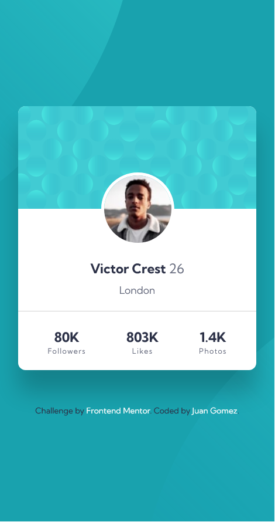

# Frontend Mentor - Profile card component solution

This is a solution to the [Profile card component challenge on Frontend Mentor](https://www.frontendmentor.io/challenges/profile-card-component-cfArpWshJ). Frontend Mentor challenges help you improve your coding skills by building realistic projects. 

## Table of contents

- [Overview](#overview)
  - [Screenshot](#screenshot)
  - [Links](#links)
- [My process](#my-process)
  - [Built with](#built-with)
  - [What I learned](#what-i-learned)
  - [Continued development](#continued-development)
  - [Useful resources](#useful-resources)
- [Author](#author)
- [Acknowledgments](#acknowledgments)

## Overview

This is my solution to the Profile card component challenge. It is a simple card
that shows the image, name, age, city and stats of a user. I practiced by using
the ::before and ::after pseudo-elements.

### Screenshot




### Links

- Solution URL: [GitHub](https://github.com/newbpydev/06-profile-card-component-main)
- Live Site URL: [Live Site](https://gifted-hopper-c0d2a1.netlify.app/)

## My process

### Built with

- Semantic HTML5 markup
- CSS custom properties
- Flexbox
- Grid

### What I learned

I have learned on this project that we need to practice everyday and work hard
to really understand how you could manipulate the elements the way that you
planned it.

```css
main::before {
  content: url('/images/bg-pattern-top.svg');
  background-repeat: no-repeat;
  background-size: cover;
  position: absolute;
  bottom: 50%;
  right: 50%;
  z-index: -1;
}
main::after {
  content: url('/images/bg-pattern-top.svg');
  background-repeat: no-repeat;
  background-size: cover;
  position: absolute;
  top: 50%;
  left: 50;
  z-index: -2;
}
```

### Continued development

For future development, I will continue to use pseudo-elements more often so I
can practice the different ways that we can use it in our day to day development.

### Useful resources

- [MDN - ::before](https://developer.mozilla.org/en-US/docs/Web/CSS/::before) - The In CSS, ::before creates a pseudo-element that is the first child of the selected element. It is often used to add cosmetic content to an element with the content property. It is inline by default.
- [MDN - ::after](https://developer.mozilla.org/en-US/docs/Web/CSS/::after) - In CSS, ::after creates a pseudo-element that is the last child of the selected element. It is often used to add cosmetic content to an element with the content property. It is inline by default.

## Author

- Website - [Juan Gomez](https://www.newbpydev.com)
- Frontend Mentor - [@newbpydev](https://www.frontendmentor.io/profile/newbpydev)
- Twitter - [@Newb_PyDev](https://twitter.com/Newb_PyDev)

## Acknowledgments

The code may not be perfect compared to my sensei @jonasschmedtman but I need
to thank him because he has shown me the ropes and now I am a confident web
designer.

